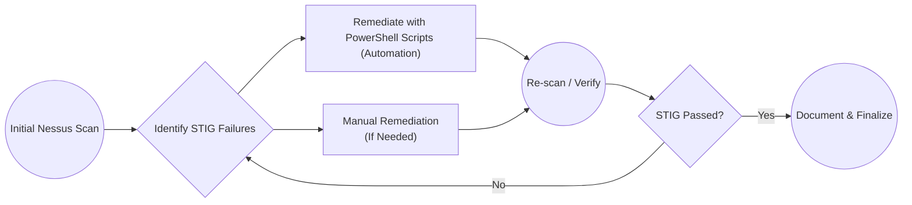

# Windows 10 STIG Remediation Repository

Welcome to my **Windows 10 STIG v3r2** remediation project! This repository documents how I systematically remediated STIG findings from an initial Tenable Nessus STIG scan on a Windows 10 Azure VM.

## Project Overview

- **Purpose**: Demonstrate the practical process of scanning a Windows 10 Azure VM with Nessus, identifying STIG findings, remediating them with PowerShell or manual configuration, and verifying the result.
- **Scope**: Focus on the DISA Windows 10 STIG v3r2 controls.

## STIG Automation Scripts

| STIG ID(s)                      | Summary                                                 | Link                                                         |
|---------------------------------|---------------------------------------------------------|--------------------------------------------------------------|
| WN10-CC-000005  | Camera access from the lock screen is disabled        | *[Disable Camera Access](./Scripts/Disable-Camera.ps1)*             |
| WN10-CC-000370                  | Disable Convenience Pin                          | *[Disable Convenience Pin](./Scripts/DisableConveniencePin)*                                       |
| WN10-00-000115 / -000160 / -000015 / -000155 | Disable Legacy Protocols (Telnet, Powershell 2.0, SMBv1) | *[Disable Protocols](./Scripts/DisableLegacyProtocols.ps1)*                                    |
| WN10-AC-000020 / -000030 / -000035  | Password policy settings      | *[Password Complexity](./Scripts/PasswordPolicy.ps1)*                                       |
| WN10-CC-000180 / -000185 / -000190 | Disable AutoPlay/AutoRun for all drives               | *[Disable AutoPlay](./docs/STIG-DisableAutoPlay.md)*                                       |
| WN10-CC-000330 / -000335 / -000345 / -000350 / -000355 / -000360  | Hardens remote management configuration | *[Configure Remote Management](./Scripts/RemoteManagement)*                                       |

## Remediation Workflow

Below is the general workflow I use:

1. **Scan** the system with Tenable Nessus STIG policy.
2. **Identify** failed STIG items.
3. **Remediate** using PowerShell scripts or manual steps.
4. **Verify** success by rescanning.

## Post-Remediation Testing

After each STIG remediation, it is important to perform basic operational checks:
- Verify event logs for errors or warnings.
- Test critical applications and workflows to ensure no disruptions.
- Monitor for any unexpected system behavior or compatibility issues.
- If a service or feature fails, consider temporarily rolling back that specific STIG setting or create an exception per organizational policy.
